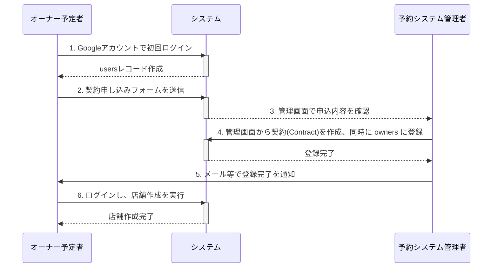

# オーナー新規契約ワークフロー

このドキュメントは、新規の店舗オーナーがシステム利用を開始するまでの、予約システム管理者とオーナー間の運用フローを定義します。

## フローの全体像

契約は、オーナー予定者がシステム上で申し込みを行い、予約システム管理者がそれを承認・登録することで成立します。
以下の図は、その際の登場人物（オーナー予定者、システム、予約システム管理者）間のやり取りの全体像を示しています。

## 具体的な手順

1.  【オーナー予定者】 Google アカウント または LINE アカウントで初回ログイン

    -   オーナー予定者は、事業者から指定された URL にアクセスし、自身の Google アカウント または LINE アカウントでログインします。
    -   認証が成功すると、システムは`users`テーブルに基本レコードを自動作成します。

2.  【オーナー予定者】 契約申し込みフォームの入力と送信

    -   初回ログイン後、オーナーは契約申し込みフォームに遷移します。
    -   フォームで自身のメールアドレスを確認し、「お客様名称」を入力して送信します。
    -   詳細は後述の「3. 契約申し込みフォーム画面仕様」を参照。

3.  【予約システム管理者】 申し込み内容の確認

    -   予約システム管理者は、管理画面の「契約申し込み一覧」(`admin/contract-applications`)で、契約申し込みがあったことを確認します。
    -   （将来的な実装：予約システム管理者への通知機能）

4.  【予約システム管理者】 契約情報のシステム登録

    -   予約システム管理者は、申し込み内容をもとに、管理画面から以下の操作を行います。
        -   契約の作成: `contracts`テーブルに新しいレコードを作成し、お客様名称や店舗上限数などを設定します。同時にシステムは`owners`テーブルに、対象のユーザーを登録します

5.  【予約システム管理者 → オーナー】 契約登録完了の通知

    -   予約システム管理者は、契約登録が完了したことをオーナーに通知します。
    -   （将来的な実装：オーナーへの通知機能。その際に、店舗作成から予約開始までのフローの記載があるページを案内する）

6.  【オーナー】 店舗の作成
    -   通知を受けたオーナーは、システムにログインし、オーナー専用画面から新しい店舗を作成します。

---

## 契約申し込みフォーム画面仕様

### 機能概要

オーナー予定者が、システム利用契約を申し込むための情報を入力する画面です。初回ログイン後に表示されます。

-   ユーザーが契約申込情報を入力・送信できる。
-   入力内容は `contract_applications` テーブルに保存され、システム管理者による確認対象となる。
-   この時点では `owners` テーブルや `contracts` テーブルのレコードは作成しない。

### 対象ユーザー

-   オーナー予定者 (予約システム契約を希望するユーザー)

### 画面仕様詳細 (`/contract-applications/create`)

#### 表示項目一覧

| 項目           | 必須 | 型     | 備考                       |
| -------------- | ---- | ------ | -------------------------- |
| user_id        | ○    | hidden | ログインセッションから取得 |
| メールアドレス | ○    | email  | フォーム入力               |
| お客様名称     | ○    | string | フォーム入力               |

#### UI 要素

-   非表示項目: user_id
-   入力フォーム: メールアドレス / お客様名称
-   ボタン: 「申し込み」

### バックエンド仕様

#### データ受け渡し

-   コントローラでセッションから user_id を取得。
-   必要に応じて users テーブルから表示用情報を取得。
-   CSRF トークンを blade → Vue に渡す。
-   渡す方法は`docs/phase-2/ARCHITECTURE.md` の方法に従う。

#### フォーム送信

-   送信先: `POST /contract-applications`
-   送信項目:

    -   user_id（hidden）
    -   メールアドレス
    -   お客様名称
    -   CSRF トークン

#### バリデーション

-   フロントエンド:

    -   必須項目チェック
    -   メールアドレス形式チェック

-   バックエンド (FormRequest: StoreContractApplicationRequest):

    -   必須項目チェック
    -   メールアドレス形式チェック
    -   セッションの user_id と POST データの一致確認

#### 処理内容

このフォーム送信の時点では、`owners`テーブルや`contracts`テーブルへのレコード作成しない。あくまで予約システム管理者による契約登録作業を依頼するための「申し込み」として扱う。

1. バリデーション成功時:

    - `contract_applications` テーブルに登録。
    - 完了ページへリダイレクト、または「お申し込みありがとうございました」と表示。

2. バリデーション失敗時:

    - 画面遷移せず、エラーメッセージを表示。

#### API エンドポイント

    契約申し込みフォームに関する API エンドポイントは提供しない。
