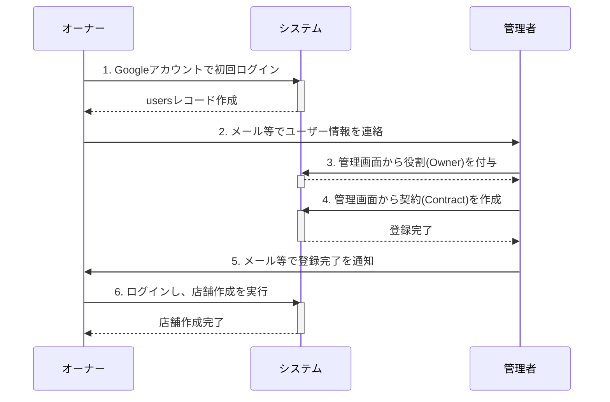

# オーナー新規契約ワークフロー

このドキュメントは、新規の店舗オーナーがシステム利用を開始するまでの、管理者とオーナー間の暫定的な運用フローを定義します。
**（注: 本フローは、契約が店舗より先行する新しい設計（パターンA）に基づいています）**

## 1. フローの全体像

契約は、オーナーが予約システム外で事業者（予約システムの運営者）と合意した後に、システムに反映させるプロセスです。
以下の図は、その際の登場人物（オーナー、システム、管理者）間のやり取りの全体像を示しています。

## 2. 具体的な手順

1.  **【オーナー】 Googleアカウントの準備**
    -   店舗オーナーは、契約に紐づけるためのGoogleアカウントを準備します。

2.  **【オーナー】 契約者としてシステムに初回ログイン**
    -   オーナーは、事業者から指定された契約開始用のURLにアクセスし、準備したGoogleアカウントでログイン（OIDC認証）します。
    -   認証が成功すると、システムは`users`テーブルにこのオーナーの基本レコードを自動的に作成します。

3.  **【オーナー → 管理者】 アカウント情報の連携**
    -   初回ログインが完了したオーナーは、システムに登録された自身の情報（ユーザーIDなど）を、何らかの手段（メール等）でシステム管理者に連絡します。

4.  **【管理者】 契約情報のシステム登録**
    -   管理者は、オーナーから連絡された情報をもとに、管理画面から以下の操作を行います。
        1.  **役割の付与**: まず、対象のユーザーに「オーナー」の役割を付与します。具体的には、管理画面から `owners` テーブルに新しいレコードを作成し、対象の `user_id` を紐付けます。
        2.  **契約の作成**: 次に、`contracts`テーブルに新しいレコードを作成します。これにより、「どのオーナー(`user_id`)」が「何店舗まで(`max_shops`)」店舗を作成できるか、といった契約内容を定義します。

5.  **【管理者 → オーナー】 登録完了の通知**
    -   管理者は、上記すべての登録が完了したことをオーナーに通知します。

6.  **【オーナー】 店舗の作成**
    -   登録完了の通知を受けたオーナーは、自身のGoogleアカウントでシステムにログインします。
    -   オーナー専用の管理画面から、自身の契約内容（`max_shops`）の範囲内で、新しい店舗を作成します。

これ以降、オーナーは自身で作成した店舗の管理者として、スタッフ登録やメニュー設定などの機能を利用できるようになります。
