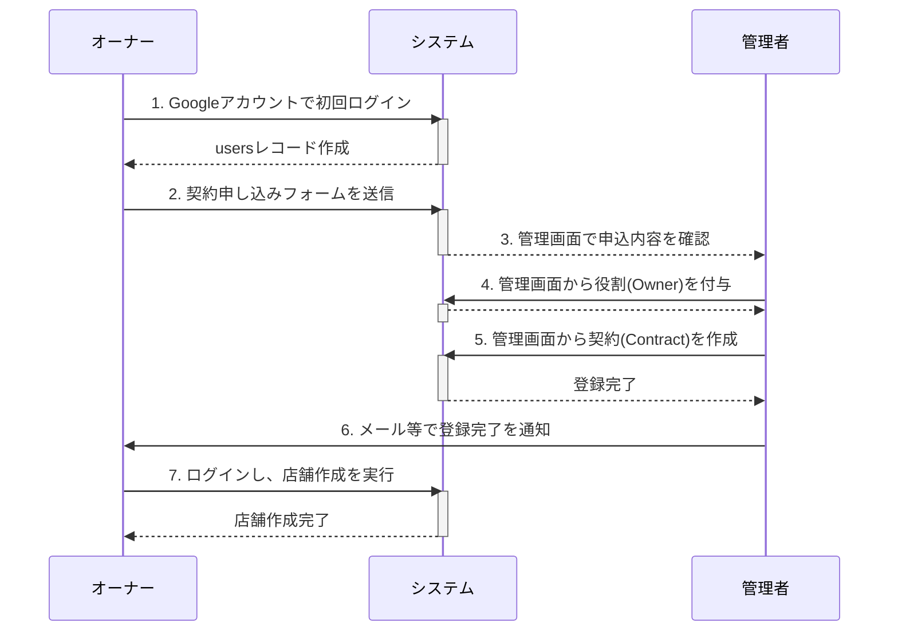

# オーナー新規契約ワークフロー

このドキュメントは、新規の店舗オーナーがシステム利用を開始するまでの、管理者とオーナー間の運用フローを定義します。

## 1. フローの全体像

契約は、オーナーがシステム上で申し込みを行い、管理者がそれを承認・登録することで成立します。
以下の図は、その際の登場人物（オーナー、システム、管理者）間のやり取りの全体像を示しています。

## 2. 具体的な手順

1.  **【オーナー】 Googleアカウントで初回ログイン**
    -   オーナー候補者は、事業者から指定されたURLにアクセスし、自身のGoogleアカウントでログインします。
    -   認証が成功すると、システムは`users`テーブルに基本レコードを自動作成します。

2.  **【オーナー】 契約申し込みフォームの入力と送信**
    -   初回ログイン後、オーナーは契約申し込みフォームに遷移します。
    -   フォームで自身の`public_id`とメールアドレスを確認し、「お客様名称」を入力して送信します。
    -   詳細は後述の「3. 契約申し込みフォーム画面仕様」を参照。

3.  **【管理者】 申し込み内容の確認**
    -   管理者は、管理画面の「契約申し込み一覧」(`admin/contract-applications`)で、契約申し込みがあったことを確認します。
    -   （将来的な実装：管理者への通知機能）

4.  **【管理者】 契約情報のシステム登録**
    -   管理者は、申し込み内容をもとに、管理画面から以下の操作を行います。
        1.  **役割の付与**: 対象のユーザーに「オーナー」の役割を付与します。
        2.  **契約の作成**: `contracts`テーブルに新しいレコードを作成し、お客様名称や店舗上限数などを設定します。

5.  **【管理者 → オーナー】 登録完了の通知**
    -   管理者は、すべての登録が完了したことをオーナーに通知します。

6.  **【オーナー】 店舗の作成**
    -   通知を受けたオーナーは、システムにログインし、オーナー専用画面から新しい店舗を作成します。

---

## 3. 契約申し込みフォーム画面仕様

### 3.1. 機能概要
オーナー候補者が、システム利用契約を申し込むための情報を入力する画面です。初回ログイン後に表示されます。

### 3.2. 画面仕様詳細

-   **URL**: `/apply-contract` （仮）
-   **表示タイミング**: Googleアカウントで初回ログインし、まだオーナー権限が付与されていないユーザーがアクセスした場合に表示。

#### 3.2.1. UI要素

| 項目名 | UI種別 | 説明 |
| :--- | :--- | :--- |
| **ユーザー公開ID** | テキスト表示 | ログイン時に自動発行された自身の`public_id`。編集は不可。 |
| **Googleアカウント** | テキスト表示 | ログインに使用したGmailアドレス。編集は不可。 |
| **お客様名称** | `input type="text"` | 管理者が契約を識別するための名称（例: 店舗名、オーナー名など）。必須入力。 |
| **申し込みボタン** | `button` | フォームの内容を送信する。 |

### 3.3. バックエンド仕様

-   **フォーム送信先**: `POST /apply-contract` （仮）
-   **処理内容**:
    1.  `StoreContractApplicationRequest`のようなFormRequestでバリデーションを実行。
    2.  （将来的な実装）`contract_applications`のような新しいテーブルに、`user_id`と入力された`お客様名称`を保存し、管理者が確認できる状態にする。
    3.  完了ページへリダイレクト、または「お申し込みありがとうございました」というメッセージを表示する。
-   **注意点**: このフォーム送信の時点では、`owners`テーブルや`contracts`テーブルへのレコード作成は**行いません**。あくまで管理者による承認・登録作業を依頼するための「申し込み」として扱います。
